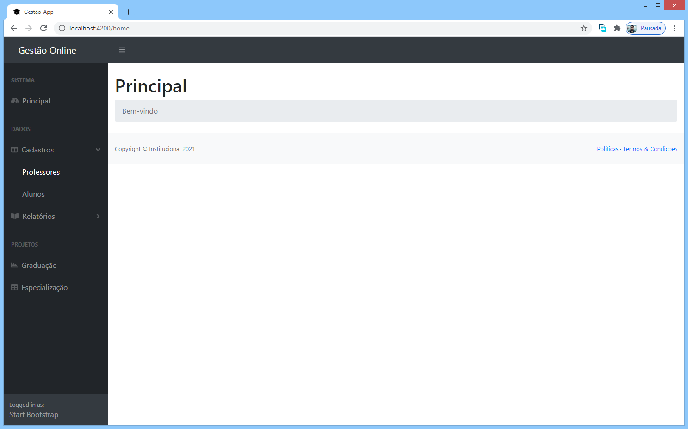

# Projeto CAEd - JAVA + Spring Boot + Angular

Este repositório armazena o código fonte desenvolvido por mim durante o periodo de participação do [.PROCESSO SELETIVO Nº 001/2021](http://fundacaocaed.org.br/#!/processoseletivos), para a vaga de desenvolvedor full stack.

O prazo para disponibilização de todo o conteúdo foi de até 05 (dias).


## Descrição do projeto: :pencil2:

- Disponibilizar um endpoint para receber dados de professores, respeitando um contrato que especifica o formato da informação para que o dado seja processado pelo sistema. O dados enviado para o endping deve ser validado e a persistência deve ser realizada por um sistema de integração de forma assíncrona, composto por microserviços que tratam a informação recebida e faz a persistência em um banco de dados.


## Recursos Utilizados: :computer:

* Para o back-end (API)

    - **[IntelliJ IDEA Community Edition](https://www.jetbrains.com/pt-br/idea/download/#section=windows)**
    - **[Spring Framework](https://spring.io/projects/spring-framework)**
    - **[Maven](https://mvnrepository.com/)**
    - **[H2 Database](http://h2database.com/html/main.html)**
    - **[Lombok](https://projectlombok.org/)**

* Para o front-end

    - **[Visual Studio Code](https://code.visualstudio.com/)**
    - **[Fira Code](https://github.com/tonsky/FiraCode)**
    - **[Node.JS](https://nodejs.org/en/)**
    - **[Angular CLI](https://cli.angular.io/)**
    - **[Start Bootstrap Template](https://startbootstrap.com/template/sb-admin)**

* Container para execução no Linux

    - **[Docker](https://www.docker.com/)**


## Diferenciais de avaliação: :pencil2:

 * **< Feito > Criar um front end usando AngularJs para envio das requisições**
 * **< Feito > Criar testes unitários**
 * **< Feito > Executar os serviços em containers docker**
 * Usar alguma ferramenta para auxiliar na comunicação entre os serviços
    - Apache Kafka
    - ActiveMQ
    - RabbitMQ
 * Desenvolver algum micro serviço em GoLang
 * Monitoramento dos logs
    - Elasticsearch
    - Kibana


## Rodando o projeto: :computer:

* Para configurar a API é necessário, a partir de um terminal Linux:

    - Build do container, utilizando o arquivo "Dockerfile" na pasta Docker:
     ```
    > docker build -t java-api .
    ```
    - Gerar imagem do container com o comando: 
    ```
    > docker run -p 8080:8080 --name javaapi java-api
    ```

* Para configurar a interface do sistema:

    - Rodar no terminal Linux, na pasta "ensino-adm-app", o comando
    ```
    > docker build -t angular-app .
    ```
    - Gerar imagem do container com o comando:
    ```
    > docker run -p 4200:4200 --name angularapp angular-app
    ```


## Testando os endpoints via terminal:  :computer:

Na pasta Docker, enviar os métodos post e get:

### Post
```
> curl -i -X POST -H "Content-Type: application/json" -d "{\"nome\":\"wagner\",\"cpf\":\"43236560177\",\"nascimento\":\"1978-09-12\",\"sexo\":\"M\",\"email\":\"wagnerjf@gmai.com\"}" http://localhost:8080/api/professores
```

### Get
```
> curl -i -H "Accept: application/json" -H "Content-Type application/json" -X GET http://localhost:8080/api/professores/1
```


## Acesso a aplicação no navegador: :computer:

* Endpoints da API - http://localhost:8080

    - **[ GET ](http://localhost:8080/api/professores/1)**
    - **[ POST ](http://localhost:8080/api/professores)**
    - **[ PUT ](http://localhost:8080/api/professores/1)**
    - **[ DELETE ](http://localhost:8080/api/professores/1)**

* App Web (Interface Angular)

    - **[ Home ](http://localhost:4200)**
    - **[ Lista Professores ](http://localhost:4200/cadastros/professores-lista)**   
    - **[ Cadastra Professores ](http://localhost:4200/cadastros/professores)**


## Screen Shots da Aplicação Feita:

### Página Principal:



### Lista de Professores


### Cadastro de Professores


### Cadastro de Professores - Mensagens


### Cadastro de Professores - Edição


### Cadastro de Professores - Deleção

